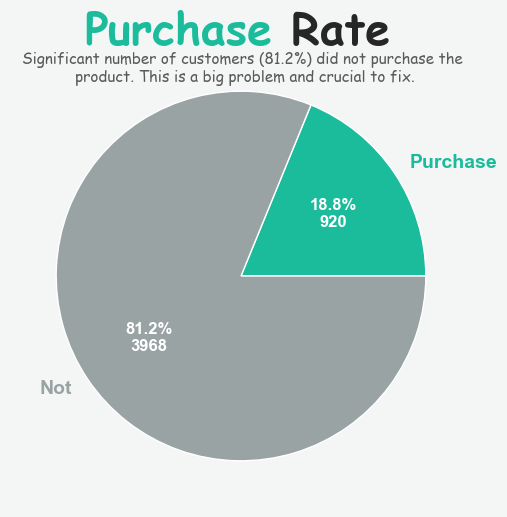
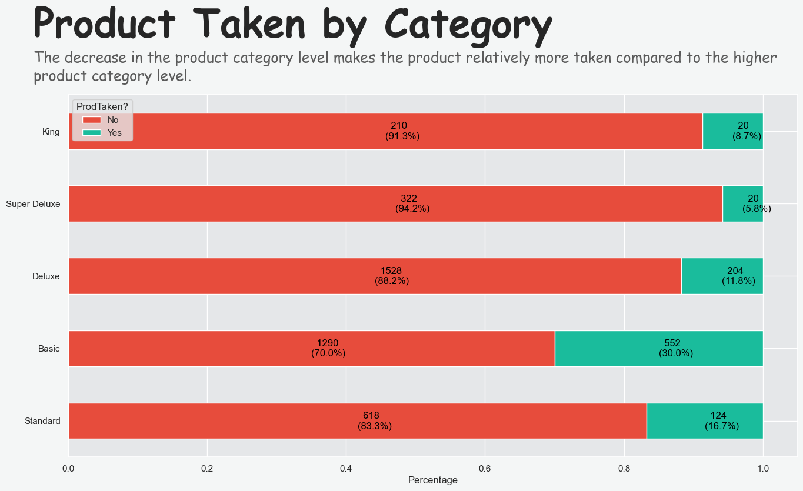
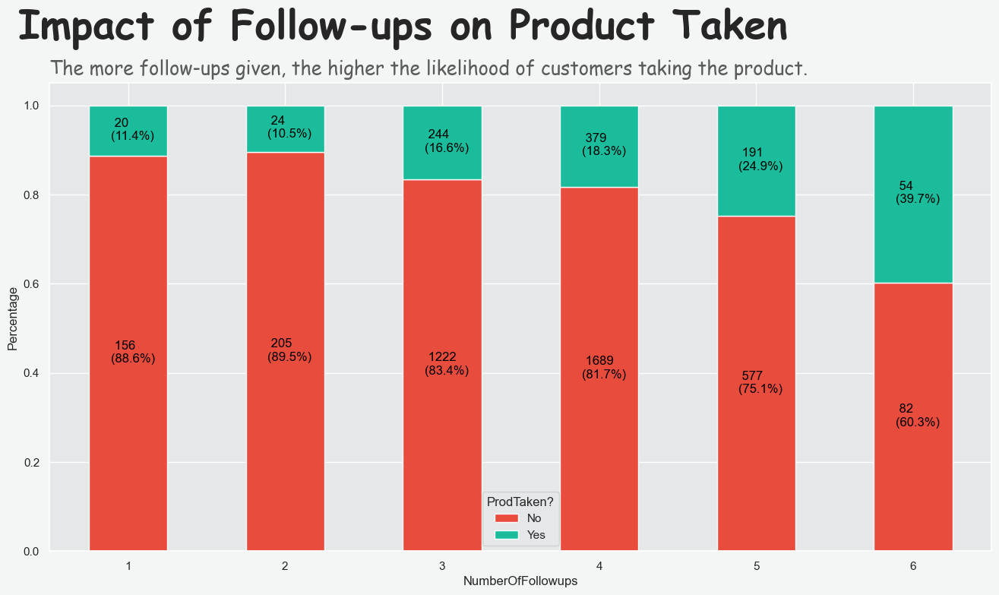
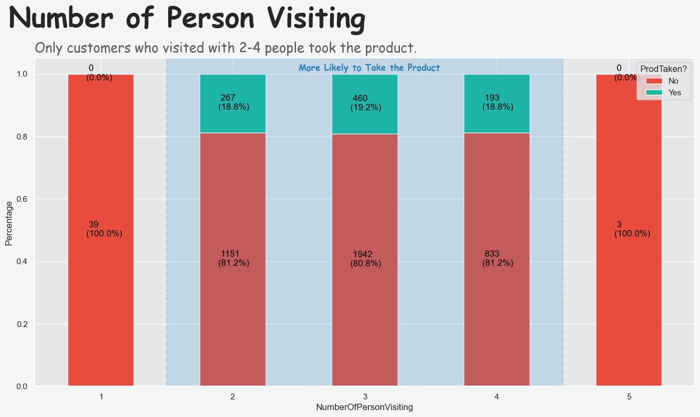
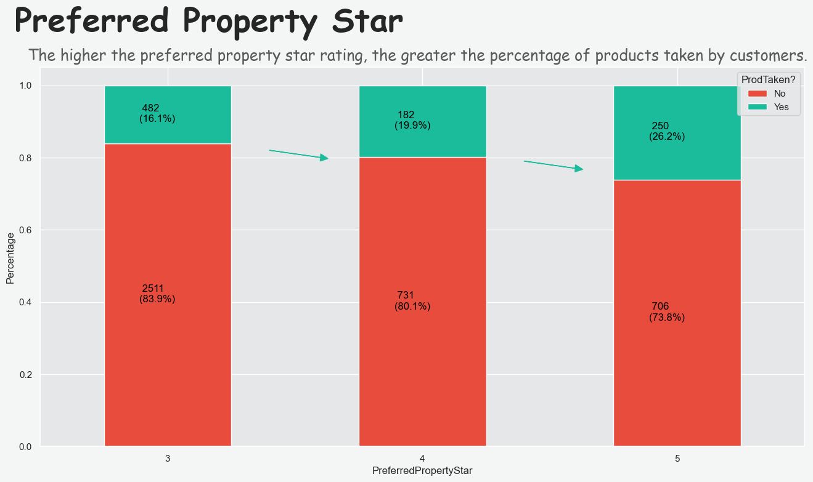
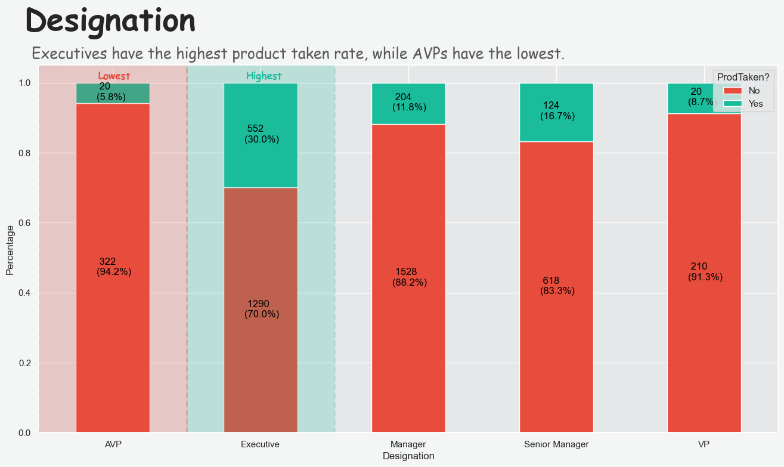

# Holiday Package Prediction

- Dataset: Sourced from [kaggle](https://www.kaggle.com/datasets/susant4learning/holiday-package-purchase-prediction).
- Programming Language: Python Version 3.12.3
- Library:
    - pandas version 2.2.2
    - matplotlib version 3.8.4
    - seaborn version 0.13.2
    - numpy version 1.26.4
    - math

## Business Understanding

**"Trips & Travel.com"** company wants to enable and establish a viable business model to expand the customer base. Currently, the company offers five types of packages: Basic, Standard, Deluxe, Super Deluxe, and King. *Last year's data found that 18% of customers purchased these packages. However, the marketing costs were high due to random customer outreach without utilizing available information.* The company now plans to launch a new product: the Wellness Tourism Package. Wellness Tourism involves travel that helps maintain, enhance, or start a healthy lifestyle, boosting one's overall well-being. *This time, the company intends to use existing data on current and potential customers to optimize marketing expenses efficiently.*

Based on this, we can determine the goals, objectives, and key metrics for this project:

**Goals:**
- Increase the customer purchase rate
- Reduce marketing costs

**Objective:**
- Utilize available data to target potential customers more effectively.
- Optimize marketing strategies to ensure cost-efficiency and higher conversion rates.

**Key Metrics**
- Customer purchase rate: Measure the percentage increase in package purchases.
- Return on investment (ROI): Assess the financial returns from the new Wellness Tourism Package and overall marketing efforts.

## Data Understanding

The dataset used in this analysis is sourced from Kaggle, titled [Holiday Package Prediction](https://www.kaggle.com/datasets/susant4learning/holiday-package-purchase-prediction). It contains 4888 rows and 20 columns. The dataset includes the following columns:

1. **CustomerID**: Unique identifier for each customer.
2. **ProdTaken**: Indicates whether the product was taken (True/False).
3. **Age**: Age of customer.
4. **TypeofContact**: How customer was contacted (Company Invited or Self Inquiry).
5. **CityTier**: City tier depends on the development of a city, population, facilities, and living standards. The categories are ordered.
6. **DurationOfPitch**: Duration of the pitch by a salesperson to the customer.
7. **Occupation**: Occupation of customer.
8. **Gender**: Gender of customer.
9. **NumberOfPersonVisiting**: Total number of persons planning to take the trip with the customer.
10. **NumberOfFollowups**: Total number of follow-ups has been done by the salesperson after the sales pitch.
11. **ProductPitched**: Product pitched by the salesperson.
12. **PreferredPropertyStar**: Preferred hotel property rating by customer.
13. **MaritalStatus**: Marital status of customer.
14. **NumberOfTrips**: Average number of trips in a year by customer.
15. **Passport**: Indicates if the customer has a passport (0: No, 1: Yes).
16. **PitchSatisfactionScore**: Satisfaction score of the sales pitch.
17. **OwnCar**: Indicates if the customer owns a car (0: No, 1: Yes).
18. **NumberOfChildrenVisiting**: Total number of children with age less than 5 planning to take the trip with the customer.
19. **Designation**: Job title of the customer in their current organization.
20. **MonthlyIncome**: Gross monthly income of the customer.

## Business Insight
### - Purchase Rate

  

**Insight**
- A significant number of customers (81.2%) did not purchase the product. This may be because the target customers do not align with the product.

**Recommendation**
- Understanding the customers' needs and reasons is crucial so we can identify and address their problems effectively.

### - Product Taken by Category

  

**Insight**
- Majority of customers did not take the product.
- The **Basic category** has the largest percentage of "Yes" responses (30%), showing relatively higher interest compared to other categories.
- The **Super Deluxe** category has the highest percentage of "No" responses (94.2%), indicating the lowest interest among the categories.
- Two of the highest categories (Super Deluxe and King) have the lowest Product Taken.

**Recommendation**
- Understanding the reasons behind the higher interest in the 'Basic' category could provide insights for improving product offerings and reducing marketing costs.
- Marketing strategies or product feature might need to be reassessed, especially for the "Super Deluxe" and "King" categories.

### - Impact of Follow-ups on Product Taken

  

### Insight
- More follow-ups enhance the likelihood of customers taking the product. However, this is not efficient because it also increases marketing costs.

### Recommendation
- An effective follow-up strategy is crucial. We need to identify the best follow-up strategy to limit the number of follow-ups and reduce marketing costs incurred by sales personnel.

### - Number of Person Visiting

  

**Insight:**
- Only customers who visited with 2-4 people took the product.

**Recommendation:**
- Understanding why customers who visited with 2-4 people took the product, while those who visited with 1 or 5 people did not, is crucial for improving marketing strategies.

### - Preferred Property Star

  

**Insight:**
- As the preferred property star rating increases, so does the likelihood of customers taking the product.
- However, across all property star ratings, the majority of customers (>70%) still do not take the product.

**Recommendation:**
- Understanding why customers prefer higher star ratings is crucial for refining and enhancing marketing strategies.
- After gaining this understanding, implement targeted marketing campaigns and offers that are more appropriate for these customer preferences.

### - Designation

  

**Insight:**
- The designation of customers significantly impacts the likelihood of them taking the product.
- Executives show the highest product take-up rate, with 30.0% (552 out of 1842) taking the product.
- Senior Managers and Managers also show higher take-up rates compared to AVP and VP, with 16.7% and 11.8% respectively.
- AVP and VP have the lowest take-up rates at 5.8% and 8.7%, respectively.

**Recommendation:**
- Focus marketing efforts on Executives, Senior Managers, and Managers, who show a higher likelihood of taking the product. Tailor campaigns to address their specific needs and preferences.
- Investigate why AVPs and VPs have lower product adoption rates to refine and enhance marketing strategies.
- Develop different marketing approaches based on the unique characteristics and needs of each designation to improve overall product adoption.